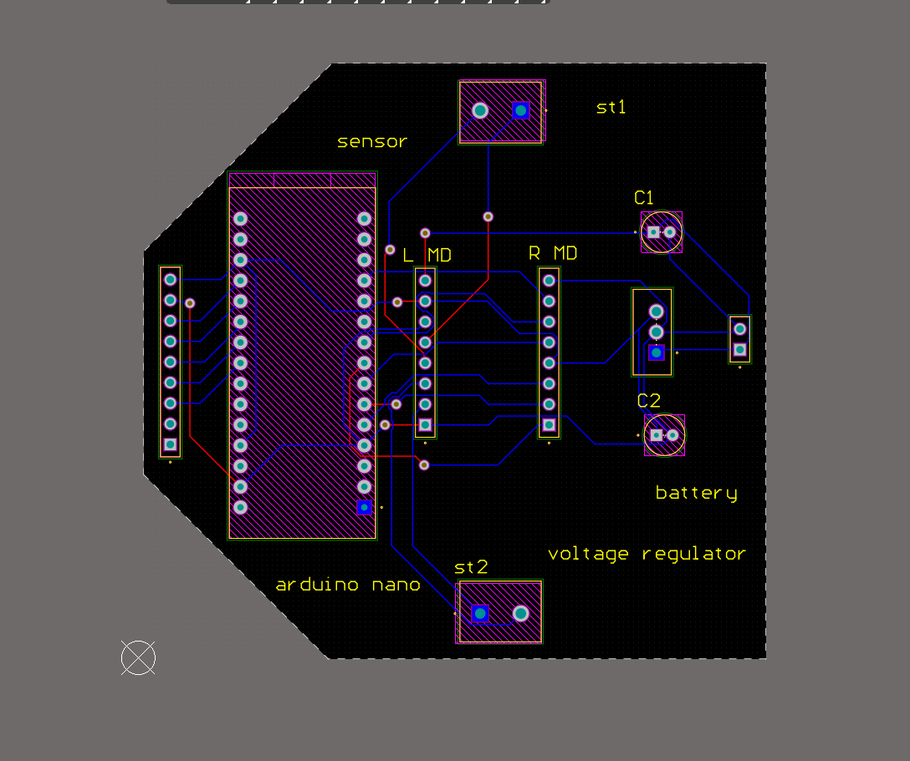
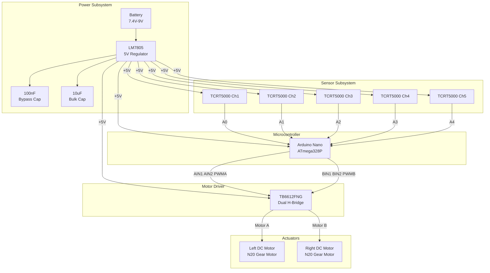

# Autonomous Industrial Line-Following Robot

A compact, PCB-integrated autonomous line-following robot built on the Arduino Nano platform. This project demonstrates embedded systems design encompassing custom PCB development, sensor integration, motor control, and real-time firmware development.



---

## Project Overview

This repository documents the complete design, development, and validation of an autonomous line-following robot intended for industrial and academic applications. The system uses infrared sensor arrays to detect and track a contrasting line on a flat surface, executing proportional-derivative (PD) control to maintain trajectory with minimal oscillation.

The robot is built around a custom-designed two-layer PCB that integrates power regulation, motor driving, sensor interfacing, and microcontroller hosting into a single compact board.

---

## Engineering Objectives

| Objective | Description |
|-----------|-------------|
| **Sensor Integration** | Interface a 5-channel IR sensor array for real-time line position detection |
| **Motor Control** | Implement bidirectional DC motor control with PWM-based speed regulation |
| **Power Management** | Design a regulated power distribution system from battery source to all subsystems |
| **PCB Design** | Develop a custom two-layer PCB with proper power integrity and signal routing |
| **Embedded Firmware** | Write efficient Arduino-based firmware implementing PD line-following control |
| **System Integration** | Combine all subsystems into a functional, testable autonomous platform |

---

## Key Features

- **5-Channel IR Sensor Array** — TCRT5000-based reflective sensors for robust line detection across varying surface conditions
- **Dual H-Bridge Motor Driver** — TB6612FNG driver for independent left/right motor control with PWM speed regulation
- **Regulated Power Architecture** — LM7805-based 5V regulation with bulk and bypass capacitors for noise suppression
- **Custom PCB Design** — Two-layer board designed in Altium Designer with optimized component placement and routing
- **PD Control Algorithm** — Proportional-derivative control for smooth trajectory tracking with minimal overshoot
- **Compact Form Factor** — Single-board design reducing wiring complexity and improving reliability

---

## System Architecture



---

## Hardware Components

| Component | Part Number | Quantity | Function |
|-----------|-------------|----------|----------|
| Arduino Nano | ATmega328P | 1 | Main microcontroller, PD computation, I/O control |
| TB6612FNG Motor Driver | TB6612FNG | 1 | Dual H-Bridge motor driver, PWM speed control |
| TCRT5000 IR Sensor | TCRT5000 | 5 | Reflective IR sensor for line detection |
| N20 DC Gear Motor | N20 | 2 | Compact gear motors for wheel actuation |
| LM7805 Voltage Regulator | LM7805CFG | 1 | 5V linear voltage regulation from battery |
| Electrolytic Capacitor | ECEA1HKS4R7 | 1 | 10uF bulk capacitance on regulator output |
| Ceramic Capacitor | 100nF | 1 | Bypass capacitor on regulator input |
| SSQ-109-06-G-S Header | Samtec SSQ | 1 | 9-pin sensor interface connector |
| SSQ-108-X-X-S Header | Samtec SSQ | 2 | 8-pin motor driver interface connectors |
| SSQ-102-03-F-S Header | Samtec SSQ | 1 | 3-pin battery input connector |

---

## PCB Design

The custom PCB was designed in Altium Designer as a two-layer board with the following considerations:

- **Component Placement**: Arduino Nano centrally located for short trace runs to peripherals. Motor driver positioned between Nano and motor connectors. Sensor header along the front edge for optimal sensor positioning.
- **Power Distribution**: Dedicated power traces routed with adequate width for motor current. Separate +5V regulation section with proper input/output capacitance.
- **Signal Routing**: Analog sensor traces routed away from power lines to minimize noise coupling. Motor driver control signals kept short and direct.
- **Board Outline**: Custom polygon shape optimized for robot chassis mounting with mounting holes at corners.

See [PCB Design Documentation](docs/pcb-design.md) for detailed analysis.

---

## Embedded Control

The firmware implements a PD (Proportional-Derivative) control algorithm:

1. **Sensor Acquisition** — Reads 5 analog IR sensor values at defined intervals
2. **Position Calculation** — Computes weighted average of sensor readings to determine line position
3. **Error Computation** — Calculates error term (deviation from center position)
4. **PD Control** — Applies proportional and derivative terms to compute motor correction
5. **Motor Command** — Translates correction value into differential PWM signals for left/right motors

```
Motor_Output = Kp * error + Kd * (error - prev_error)
Left_Motor  = Base_Speed + Motor_Output
Right_Motor = Base_Speed - Motor_Output
```

---

## Testing and Validation

| Test Category | Description | Status |
|---------------|-------------|--------|
| Sensor Calibration | Individual IR sensor threshold verification across line/surface | Verified |
| Motor Driver | PWM response validation, direction control, stall current measurement | Verified |
| Power Integrity | Regulated voltage stability under varying load conditions | Verified |
| PD Tuning | Kp and Kd parameter optimization for smooth line tracking | Tuned |
| Integration Testing | Full system autonomous line-following on standard test track | Validated |

See [Testing & Validation Documentation](docs/testing-and-validation.md) for detailed procedures.

---

## Project Structure

```
Autonomous-Line-Following-Robot/
├── README.md                          # This file
├── LICENSE                            # MIT License
├── docs/
│   ├── architecture.md                # System architecture deep-dive
│   ├── hardware-design.md             # Hardware design documentation
│   ├── pcb-design.md                  # PCB design methodology and decisions
│   └── testing-and-validation.md      # Testing procedures and results
├── images/
│   ├── robot_photos/                  # Assembled robot photographs
│   ├── schematics/                    # Schematic screenshots
│   └── pcb/                           # PCB layout screenshots
├── firmware/                          # Arduino firmware source code
└── hardware/
    ├── schematics/                    # Altium schematic files (.schdoc)
    ├── pcb/                           # Altium PCB layout files (.PcbDoc)
    └── track-move.PrjPcb              # Altium project file
```

---

## Lessons Learned

1. **Power Supply Decoupling** — Adequate bypass capacitance near the motor driver IC is critical to prevent voltage dips during motor startup transients.
2. **Sensor Mounting Height** — TCRT5000 sensors are sensitive to distance from the reflecting surface; consistent mounting height (5-10mm) is essential for reliable detection.
3. **PWM Frequency Selection** — Motor driver PWM frequency must be chosen to avoid audible noise while maintaining sufficient torque at low speeds.
4. **Ground Plane Design** — A continuous ground plane on the bottom layer significantly reduces noise in analog sensor readings.
5. **Connector Selection** — Pin header connectors provide reliable, serviceable connections for prototyping; consider screw terminals for production.

---

## Future Improvements

- **PID Control** — Upgrade from PD to full PID control for improved steady-state error correction
- **Speed Optimization** — Implement adaptive speed control (slow on curves, fast on straights)
- **Wireless Telemetry** — Add Bluetooth module for real-time parameter tuning and data logging
- **Multi-Line Detection** — Extend sensor array to detect intersections, markers, and track features
- **PCB Revision** — Add dedicated motor driver IC footprint (TB6612FNG) directly on board instead of header-based module
- **Battery Monitoring** — Implement voltage divider circuit for battery level monitoring via ADC

---

## License

This project is licensed under the MIT License. See [LICENSE](LICENSE) for details.

---

## Author

*Academic Embedded Systems Project*

For questions or collaboration inquiries, please open an issue on this repository.
