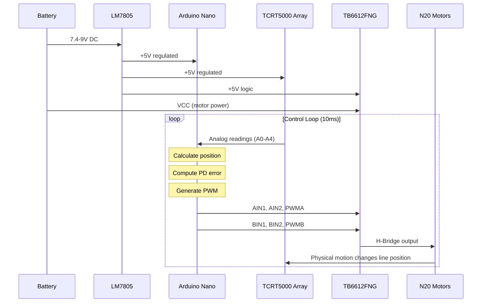

# System Architecture

This document describes the complete system architecture of the Autonomous Industrial Line-Following Robot, detailing each subsystem, signal flow, and control methodology.

---

## System Overview

The robot operates as a closed-loop control system with the following fundamental loop:

```
Sensors → Microcontroller → Motor Driver → Motors → Robot Motion → Sensors
```

This continuous feedback loop enables the robot to track a line autonomously by constantly correcting its trajectory based on sensor readings.

---

## Subsystem Architecture

### 1. Power Subsystem

**Purpose**: Convert unregulated battery voltage to a stable 5V supply for all digital and analog components.

**Components**:
- Battery input connector (SSQ-102-03-F-S): Accepts 7.4V–9V DC input
- LM7805CFG linear voltage regulator: Steps down to regulated 5V
- Input capacitor C1 (100nF ceramic): High-frequency noise filtering
- Output capacitor C2 (10uF electrolytic): Bulk energy storage and transient response

**Power Flow**:
```
Battery (7.4-9V) → [C1: 100nF] → LM7805 IN → LM7805 OUT → [C2: 10µF] → +5V Rail
                                                                      ↓
                                                            Arduino Nano
                                                            TB6612FNG (VCC)
                                                            TCRT5000 Array
```

**Design Considerations**:
- The LM7805 requires a minimum 2V dropout voltage, so input must be ≥7V for reliable 5V output
- Maximum output current is 1A (limited by LM7805 and thermal dissipation)
- Motor driver receives battery voltage directly (VCC pin) for motor power, with 5V for logic
- Bypass capacitors placed as close as possible to regulator pins

---

### 2. Microcontroller Subsystem

**Purpose**: Execute PD control algorithm, read sensors, and generate motor control signals.

**Component**: Arduino Nano (ATmega328P)

**Pin Assignment**:

| Pin | Function | Direction | Connection |
|-----|----------|-----------|------------|
| A0 | Analog Input | Input | TCRT5000 Channel 1 (leftmost) |
| A1 | Analog Input | Input | TCRT5000 Channel 2 |
| A2 | Analog Input | Input | TCRT5000 Channel 3 (center) |
| A3 | Analog Input | Input | TCRT5000 Channel 4 |
| A4 | Analog Input | Input | TCRT5000 Channel 5 (rightmost) |
| D2 | Digital Output | Output | TB6612FNG AIN1 (motor A direction) |
| D3 | Digital Output | Output | TB6612FNG AIN2 (motor A direction) |
| D5 | PWM Output | Output | TB6612FNG PWMA (motor A speed) |
| D4 | Digital Output | Output | TB6612FNG BIN1 (motor B direction) |
| D7 | Digital Output | Output | TB6612FNG BIN2 (motor B direction) |
| D6 | PWM Output | Output | TB6612FNG PWMB (motor B speed) |
| +5V | Power Input | Power | Regulated 5V from LM7805 |
| GND | Ground | Power | Common ground |

**Processing Loop**:
1. Read all 5 analog sensor channels
2. Calculate weighted line position
3. Compute error from center
4. Apply PD control law
5. Update PWM outputs
6. Repeat at fixed interval (10ms typical)

---

### 3. Sensor Subsystem

**Purpose**: Detect the line position relative to the robot center.

**Component**: 5x TCRT5000 Reflective IR Sensor Modules

**Operating Principle**:
- Each TCRT5000 contains an IR emitter and phototransistor
- IR light reflects off light surfaces (high reading) and is absorbed by dark surfaces (low reading)
- The sensor array outputs analog voltages proportional to reflectivity
- A dark line on a light surface produces low readings on sensors over the line

**Sensor Array Configuration**:
```
Position:   [S1]   [S2]   [S3]   [S4]   [S5]
Arduino Pin: A0     A1     A2     A3     A4
Location:    Left   Left-  Center Right- Right
                      Mid          Mid
```

**Weighted Position Calculation**:
```c
position = (S1 * 1 + S2 * 2 + S3 * 3 + S4 * 4 + S5 * 5) / (S1 + S2 + S3 + S4 + S5)
```

This produces a value from 1.0 (line at far left) to 5.0 (line at far right), with 3.0 being centered.

**Interface**: Direct analog connection to Arduino Nano ADC pins. No multiplexing required.

---

### 4. Motor Driver Subsystem

**Purpose**: Translate low-power microcontroller signals into high-current motor drive.

**Component**: TB6612FNG Dual H-Bridge Motor Driver

**Key Specifications**:
- Supply voltage: 2.5V–13.5V (motor), 2.5V–5.5V (logic)
- Output current: 1.2A continuous per channel, 3.2A peak
- Low saturation voltage (MOSFET-based H-bridge)
- Built-in thermal shutdown

**Control Interface**:

| Arduino Pin | TB6612FNG Pin | Function |
|-------------|---------------|----------|
| D2 | AIN1 | Motor A direction bit 1 |
| D3 | AIN2 | Motor A direction bit 2 |
| D5 | PWMA | Motor A speed (PWM) |
| D4 | BIN1 | Motor B direction bit 1 |
| D7 | BIN2 | Motor B direction bit 2 |
| D6 | PWMB | Motor B speed (PWM) |

**Direction Control Truth Table**:

| AIN1 | AIN2 | Motor A Direction |
|------|------|-------------------|
| HIGH | LOW | Forward |
| LOW | HIGH | Reverse |
| LOW | LOW | Brake (short) |
| HIGH | HIGH | Brake (short) |

**Motor Power Path**:
```
Battery VCC → TB6612FNG VM pin → H-Bridge → Motor terminals
5V Rail     → TB6612FNG VCC pin → Logic supply
```

> **Note**: The motor driver module is connected via SSQ-108-X-X-S pin headers, allowing easy replacement or servicing.

---

### 5. Actuator Subsystem

**Purpose**: Convert electrical drive signals into mechanical motion.

**Components**: 2x N20 DC Gear Motors

**Specifications** (typical N20):
- Operating voltage: 3V–6V
- No-load speed: ~200 RPM at 6V
- Stall torque: ~15 g·cm
- Gear ratio: ~1:100

**Mechanical Configuration**:
- Differential drive: two independently controlled wheels
- Left motor connected to TB6612FNG Channel A
- Right motor connected to TB6612FNG Channel B
- Steering achieved through speed differential (no steering mechanism)

**Turning Dynamics**:
| Left Speed | Right Speed | Motion |
|------------|-------------|--------|
| Equal | Equal | Straight forward |
| Lower | Higher | Turn left |
| Higher | Lower | Turn right |
| Forward | Reverse | Spin in place |

---

## Signal Flow Diagram



---

## Timing Analysis

| Operation | Duration | Frequency |
|-----------|----------|-----------|
| ADC Conversion (5 channels) | ~100 µs | — |
| PD Calculation | ~20 µs | — |
| PWM Update | ~10 µs | — |
| **Total Loop Time** | **~130 µs** | **~7.7 kHz theoretical** |
| Practical Loop Time | ~10 ms | ~100 Hz (with delay) |

> The firmware typically operates at 100 Hz (10ms loop), which is well within the mechanical response time of the N20 gear motors.

---

## Grounding Strategy

- **Common Ground**: All subsystems share a single ground reference connected through the PCB ground plane
- **Star Grounding**: Power ground (motor return) and signal ground (sensor/ADC) are connected at a single point near the voltage regulator
- **Ground Plane**: Bottom PCB layer uses a continuous ground pour to minimize impedance and noise coupling

---

## Failure Modes and Protections

| Failure Mode | Cause | Protection |
|--------------|-------|------------|
| Motor stall current | Mechanical jam | TB6612FNG thermal shutdown at ~150°C |
| Voltage spike | Motor back-EMF | TVS diode (if present) or input capacitor absorption |
| Sensor noise | Electrical interference | 100nF bypass caps on sensor supply, software filtering |
| Brown-out | Battery depletion | ATmega328P internal brown-out detection at 2.7V |
| Overheating | Sustained high current | LM7805 thermal shutdown at ~175°C |

---

## Design Assumptions

> The following items are inferred from the schematic and PCB layout. Exact values should be verified against the Altium project files.

1. Motor driver module is assumed to be TB6612FNG based on pin count and application context
2. IR sensors are assumed to be TCRT5000 modules based on the 5-channel configuration and analog output
3. N20 gear motors are assumed based on connector labels and application requirements
4. PWM frequency is assumed to be default Arduino configuration (~490 Hz or ~980 Hz depending on pin)
5. Control loop timing is firmware-dependent and subject to implementation details

---

## References

1. Arduino Nano Datasheet — ATmega328P
2. TB6612FNG Dual H-Bridge Motor Driver Datasheet
3. TCRT5000 Reflective Optical Sensor Datasheet
4. LM7805 Linear Voltage Regulator Datasheet
5. N20 DC Gear Motor Specifications
