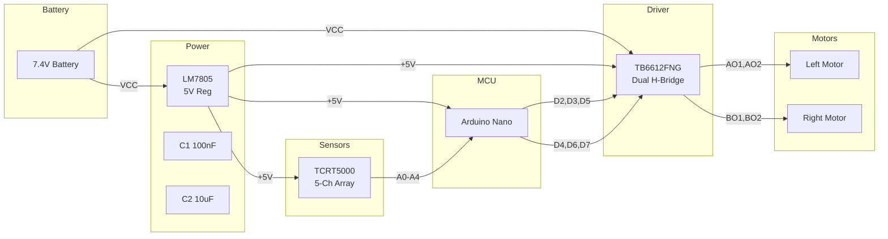

# Hardware Design Documentation

This document provides a detailed analysis of the hardware design for the Autonomous Industrial Line-Following Robot, covering schematic design decisions, component selection rationale, and circuit analysis.

---

## Design Overview

The hardware consists of a single custom PCB that integrates all subsystems: power regulation, microcontroller hosting, motor driving, and sensor interfacing. The design was developed in Altium Designer using a two-layer PCB stackup.

---

## Schematic Analysis

The schematic is organized into five distinct functional blocks:

### Block 1: Power Supply


**Circuit Description**:

```
Battery+ ──┬── C1 (100nF) ──┬── LM7805 IN
           │                │
           │            LM7805 GND
           │                │
           │            LM7805 OUT ──┬── C2 (10µF) ──┬── +5V Rail
           │                        │               │
           │                        │           [To All Subsystems]
           │                        │
Battery- ──┴────────────────────────┴── GND
```

**Component Selection Rationale**:

| Component | Selected | Alternative Considered | Reason for Selection |
|-----------|----------|----------------------|---------------------|
| Voltage Regulator | LM7805CFG | LM1117-5.0, LM2596 | Simple, reliable, sufficient current for this application |
| Input Capacitor | 100nF ceramic | 10µF electrolytic | Ceramic preferred for high-frequency noise; bulk cap on output |
| Output Capacitor | 10µF electrolytic | 100µF electrolytic | Provides adequate transient response for motor current steps |

**Power Budget Analysis**:

| Subsystem | Nominal Current | Peak Current |
|-----------|----------------|--------------|
| Arduino Nano | ~45 mA | ~50 mA |
| TB6612FNG Logic | ~10 mA | ~20 mA |
| TCRT5000 Array (5x) | ~50 mA | ~75 mA |
| **Total 5V Rail** | **~105 mA** | **~145 mA** |
| Motors (2x N20) | ~150 mA | ~400 mA (stall) |

> The LM7805 comfortably handles the 5V rail requirements. Motor current is supplied directly from battery through the TB6612FNG, bypassing the regulator.

---

### Block 2: Microcontroller

**Component**: Arduino Nano (ATmega328P-based module)

The Arduino Nano serves as the central processing unit, executing the control algorithm and managing all I/O operations.

**Key Connections**:

| Nano Pin | Net Name | Destination | Signal Type |
|----------|----------|-------------|-------------|
| A0 | SENSOR_CH1 | TCRT5000 Array | Analog Input |
| A1 | SENSOR_CH2 | TCRT5000 Array | Analog Input |
| A2 | SENSOR_CH3 | TCRT5000 Array | Analog Input |
| A3 | SENSOR_CH4 | TCRT5000 Array | Analog Input |
| A4 | SENSOR_CH5 | TCRT5000 Array | Analog Input |
| D2 | AIN1 | TB6612FNG | Digital Output |
| D3 | AIN2 | TB6612FNG | Digital Output |
| D4 | BIN1 | TB6612FNG | Digital Output |
| D5 | PWMA | TB6612FNG | PWM Output |
| D6 | PWMB | TB6612FNG | PWM Output |
| D7 | BIN2 | TB6612FNG | Digital Output |
| 5V | VCC | LM7805 Output | Power |
| GND | GND | Ground Plane | Power |

**Design Notes**:
- Nano is mounted via pin headers for easy removal during programming
- Reset pin is accessible via a dedicated header (st2) for in-circuit reset
- ADC pins A0–A4 are dedicated to sensor inputs to avoid multiplexing complexity
- PWM pins D5 and D6 are used for motor speed control (Timer0 and Timer0 channels)

> **Assumption**: The Arduino Nano is a pre-built module with onboard USB-to-serial converter (CH340 or FTDI). The exact variant should be verified against the physical board.

---

### Block 3: IR Sensor Array

**Component**: 5x TCRT5000 Reflective Optical Sensors

**Circuit Topology**:

```
+5V ──┬── [TCRT5000 Sensor 1] ──┬── AO1 ── A0 (Nano)
      │   [TCRT5000 Sensor 2] ──┼── AO2 ── A1 (Nano)
      │   [TCRT5000 Sensor 3] ──┼── AO3 ── A2 (Nano)
      │   [TCRT5000 Sensor 4] ──┼── AO4 ── A3 (Nano)
      │   [TCRT5000 Sensor 5] ──┴── AO5 ── A4 (Nano)
      │
GND ──┴── [All Sensors Common GND]
```

**Connector**: SSQ-109-06-G-S (9-pin header)
- 5 analog output pins
- 2 power pins (+5V, GND)
- 2 additional pins (likely reserved or unused)

**Sensor Characteristics**:

| Parameter | Value | Notes |
|-----------|-------|-------|
| Emitter wavelength | 950 nm | IR LED |
| Detection distance | 1–25 mm | Optimal at 5–10 mm |
| Output type | Analog voltage | Proportional to reflectivity |
| Supply current | ~10 mA per sensor | |
| Output voltage range | 0V – 3.3V | Dependent on surface reflectivity |

**Signal Conditioning**:
- No external signal conditioning is used; the TCRT5000 modules include onboard amplification
- The analog outputs connect directly to the Arduino ADC (0–5V range)
- Sensor height above the surface is a critical installation parameter

---

### Block 4: Motor Driver

**Component**: TB6612FNG Dual H-Bridge Motor Driver

The motor driver module interfaces with the PCB via two SSQ-108-X-X-S (8-pin) connectors labeled "L MD" (Left Motor Driver) and "R MD" (Right Motor Driver).

**Pin Mapping**:

```
L MD Connector (Left Motor):
  Pin 1: +VCC (Battery voltage, motor supply)
  Pin 2: +5V (Logic supply)
  Pin 3: GND
  Pin 4: GND
  Pin 5: AIN2 ← Nano D3
  Pin 6: AIN1 ← Nano D2
  Pin 7: AO2  → Left Motor Terminal 2
  Pin 8: AO1  → Left Motor Terminal 1

R MD Connector (Right Motor):
  Pin 1: PWMA ← Nano D5
  Pin 2: AIN2
  Pin 3: BIN1 ← Nano D4
  Pin 4: AIN1
  Pin 5: BIN2 ← Nano D7
  Pin 6: PWMB ← Nano D6
  Pin 7: +5V
  Pin 8: GND
```

**Motor Terminal Connections**:
- Left motor: Connected via st1 connector (labeled "Motors Entry" in schematic)
- Right motor: Connected via st2 connector

**Driver Operating Modes**:

| Mode | AIN1 | AIN2 | PWMA | Result |
|------|------|------|------|--------|
| Forward | 1 | 0 | PWM duty | Motor spins forward at PWM speed |
| Reverse | 0 | 1 | PWM duty | Motor spins reverse at PWM speed |
| Brake | 1 | 1 | X | Motor brakes (short circuit) |
| Coast | 0 | 0 | X | Motor coasts (high impedance) |

---

### Block 5: Motor Entry (Output Connectors)

**Components**:
- st1: Motor output connector for left motor
- st2: Motor output connector for right motor

These are simple 2-pin screw terminal or pin header connections that route the TB6612FNG H-bridge outputs to the physical motors.

---

## Interconnections Summary



---

## Bill of Materials (Inferred)

| Reference | Component | Package | Qty | Notes |
|-----------|-----------|---------|-----|-------|
| U1 | Arduino Nano | Module | 1 | ATmega328P, USB interface |
| U2 | TB6612FNG Module | Module | 1 | Dual H-bridge, connected via headers |
| U3 | LM7805CFG | TO-220 | 1 | 5V linear regulator |
| IR1–IR5 | TCRT5000 Sensor | Module | 5 | Reflective IR sensor modules |
| M1, M2 | N20 DC Gear Motor | — | 2 | With wheels |
| C1 | Ceramic Capacitor 100nF | Through-hole | 1 | Regulator input bypass |
| C2 | Electrolytic Capacitor 10µF | Radial | 1 | Regulator output bulk |
| J1 | SSQ-102-03-F-S | Header | 1 | Battery input connector |
| J2 | SSQ-109-06-G-S | Header | 1 | Sensor array connector |
| J3, J4 | SSQ-108-X-X-S | Header | 2 | Motor driver connectors |
| J5, J6 | Motor Output | Connector | 2 | Motor terminal connections |

---

## Design Trade-offs

### Why Linear Regulator (LM7805) Over Switching?

| Factor | LM7805 (Linear) | LM2596 (Switching) |
|--------|-----------------|-------------------|
| Efficiency | ~50% (at 9V input) | ~85% |
| Complexity | Very simple | Requires inductor, diode |
| Noise | Very low | Higher (switching ripple) |
| Cost | Very low | Low |
| Board space | Small | Larger (external components) |

**Decision**: The linear regulator was selected for simplicity and low noise, which benefits the analog sensor readings. The efficiency penalty is acceptable given the moderate current requirements of the 5V rail.

### Why Header-Based Module Instead of Soldered IC?

The TB6612FNG is connected via pin headers rather than soldered directly to the PCB. This design choice:
- Simplifies prototyping and debugging
- Allows module replacement if damaged
- Reduces PCB complexity (no fine-pitch soldering)
- Increases overall height but acceptable for this application

---

## Assumptions and Limitations

1. **Component Values**: Capacitor values (C1=100nF, C2=10µF) are inferred from the schematic and standard practice. Exact values should be verified against the Altium schematic.

2. **Motor Driver**: The specific motor driver IC (TB6612FNG) is inferred from the application context and pin configuration. Alternative dual H-bridge drivers may be compatible.

3. **Sensor Type**: TCRT5000 is assumed based on the 5-channel analog configuration. Other reflective IR sensor modules may be compatible.

4. **Thermal Performance**: No heatsink is shown for the LM7805. At 9V input and 150mA load, power dissipation is approximately 600mW, which is within the TO-220 package capability but may require thermal consideration for sustained operation.

5. **EMI Considerations**: The schematic does not show explicit EMI filtering components beyond the bypass capacitors. For production use, additional ferrite beads or common-mode chokes may be beneficial.
