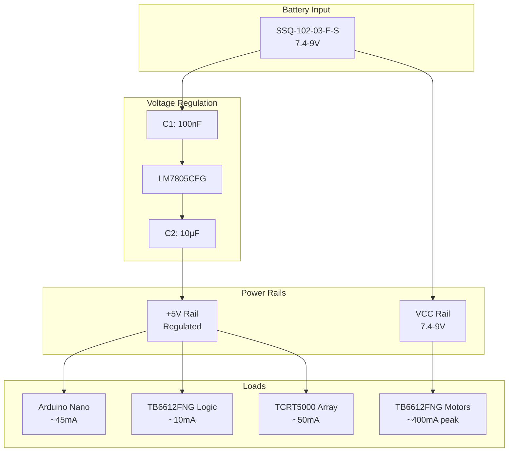

# PCB Design Documentation

This document covers the PCB design methodology, layout decisions, routing strategy, and verification process for the Autonomous Industrial Line-Following Robot custom circuit board.

---

## Design Environment

| Parameter | Value |
|-----------|-------|
| EDA Tool | Altium Designer |
| Board Type | Two-layer (双面板) |
| Layer Stack | Top Layer (components + routing), Bottom Layer (routing + ground pour) |
| Design File | `PCB1.PcbDoc` |
| Project File | `track-move.PrjPcb` |
| Schematic File | `trackmove-schem.schdoc` |

---

## PCB Layout Analysis


### Board Geometry

The PCB features a custom polygon outline, not a standard rectangular shape. The board outline is optimized to:

- Accommodate the Arduino Nano form factor centrally
- Provide mounting points for the N20 gear motors at the rear edge
- Allow sensor array positioning along the front edge
- Fit within a compact robot chassis envelope

**Estimated Dimensions**: Approximately 80mm × 70mm (inferred from component scaling).

### Component Placement Strategy

The layout follows a logical signal flow from left to right:

```
[Front Edge]                    [Center]              [Rear Edge]
IR Sensors ──────────→ Arduino Nano ──────────→ Motor Driver
(SSQ-109-06)           (Pin Headers)            (SSQ-108-X-X-S)
                                                        ↓
                                              Battery + Regulator
                                              Motor Connectors
```

**Placement Decisions**:

| Component | Placement | Rationale |
|-----------|-----------|-----------|
| Arduino Nano | Center-left | Central position minimizes trace length to both sensors and motor driver |
| Sensor Header (J2) | Front-left edge | Direct alignment with sensor array for clean analog signal routing |
| Motor Driver Headers (J3, J4) | Center-right | Short path to motor output connectors |
| Voltage Regulator (U3) | Rear-right | Isolated from sensitive analog circuits; close to battery input |
| Battery Connector (J1) | Rear-right | Direct connection to regulator and motor driver power pins |
| Motor Connectors (st1, st2) | Rear edge | Close proximity to motor driver outputs |
| Capacitors (C1, C2) | Adjacent to regulator | Minimize loop area for effective decoupling |
| Mounting Holes | Corners | Mechanical stability and chassis attachment |

---

## Routing Considerations

### Layer Assignment

| Layer | Usage |
|-------|-------|
| Top Layer (Red) | Component placement, primary signal routing, power traces |
| Bottom Layer (Blue) | Secondary signal routing, ground pour |
| Top Overlay (Yellow) | Silkscreen labels, component outlines, text annotations |
| Multi-Layer | Through-hole pads and vias |

### Trace Width Guidelines

| Net Type | Estimated Width | Reasoning |
|----------|----------------|-----------|
| Power (VCC, +5V) | 20–30 mil | Carry moderate current (up to 200mA for 5V rail) |
| Motor Power (VCC) | 30–50 mil | Higher current path for motor supply |
| Ground | 20–30 mil (or plane) | Ground pour on bottom layer handles most return current |
| Analog Signals (A0–A4) | 8–12 mil | Low-current, noise-sensitive; short runs preferred |
| Digital Control (D2–D7) | 10–15 mil | Standard signal traces |
| PWM Outputs (D5, D6) | 10–15 mil | Standard signal traces |

### Routing Observations

From the PCB layout screenshot:

1. **Power Routing**: Blue traces on the bottom layer carry power distribution, with wider traces visible connecting battery input to the regulator and motor driver power pins.

2. **Signal Routing**: Red traces on the top layer connect Arduino Nano pins to both the sensor header and motor driver headers. The routing appears direct with minimal vias.

3. **Ground Distribution**: The bottom layer features a ground pour (visible as the filled copper area), providing low-impedance return paths for all subsystems.

4. **Analog Isolation**: Sensor traces (A0–A4) are routed as a group along the left side of the board, separated from the higher-current motor driver traces on the right side.

5. **Motor Driver Connections**: The two motor driver headers (L MD and R MD) are placed symmetrically with clear routing to both the Arduino Nano control pins and the motor output connectors.

---

## Power Distribution Architecture



### Power Trace Routing

- **VCC Rail**: Direct from battery connector to motor driver VM pin and regulator input
- **+5V Rail**: From regulator output, distributed to Arduino Nano, sensor header, and motor driver VCC
- **Ground**: Common ground pour on bottom layer, connecting all subsystem returns

---

## Design Rule Check (DRC)

Based on the Altium project file, DRC verification was performed with the following checks:

| Rule Category | Description | Status |
|---------------|-------------|--------|
| Clearance | Minimum trace-to-trace spacing | Verified |
| Width | Minimum trace width meets current requirements | Verified |
| Un-Routed | All nets have complete connections | Verified |
| Short Circuit | No unintended net connections | Verified |
| Net Connectivity | All components properly connected | Verified |
| Drill Size | Via and hole sizes within fabrication limits | Verified |

### Manufacturing Constraints

| Parameter | Specification |
|-----------|--------------|
| Minimum trace width | 8 mil (0.2mm) |
| Minimum clearance | 8 mil (0.2mm) |
| Minimum drill diameter | 10 mil (0.25mm) |
| Board thickness | 1.6mm (standard FR4) |
| Copper weight | 1 oz (35µm) |
| Surface finish | HASL (Hot Air Solder Leveling) |

> **Note**: Exact DRC results should be verified by running the check in Altium Designer on the `PCB1.PcbDoc` file.

---

## Silkscreen and Documentation

The top overlay layer includes:

- **Component Reference Designators**: U1 (Arduino Nano), U3 (Regulator), C1, C2, J1–J6
- **Functional Labels**: "arduino nano", "sensor", "battery", "voltage regulator", "L MD", "R MD"
- **Connector Identification**: st1, st2 for motor outputs
- **Polarity Markings**: + and – indicators on electrolytic capacitor and connectors
- **Board Identification**: Project name and version information

---

## Fabrication Outputs

The Altium project includes output configurations for:

| Output Type | File Extension | Purpose |
|-------------|----------------|---------|
| Gerber Files | .GTL, .GBL, .GTO, .GBO, .GTS, .GBS | Layer artwork for PCB fabrication |
| NC Drill | .TXT, .DRR | Drill file for CNC drilling |
| Paste Mask | .GTP, .GBP | Solder paste stencil |
| Pick and Place | — | Component placement for assembly |
| BOM | — | Bill of materials for procurement |

---

## Design Decisions and Trade-offs

### Why Two-Layer Instead of Four-Layer?

| Factor | 2-Layer | 4-Layer |
|--------|---------|---------|
| Cost | Lower | Higher |
| Routing complexity | Higher | Lower |
| Ground plane | Partial (bottom pour) | Dedicated internal layer |
| Signal integrity | Adequate for this application | Better |
| Manufacturing | Standard process | Standard process |

**Decision**: Two-layer design is sufficient for this application's complexity and cost constraints. The ground pour on the bottom layer provides adequate return path performance.

### Why Through-Hole Connectors?

All connectors (SSQ series headers) use through-hole mounting rather than SMD. This provides:
- Higher mechanical strength for repeated plugging/unplugging
- Easier hand-soldering during prototyping
- More robust connection for the motor and battery connectors that experience mechanical stress

### Why No Dedicated Motor Driver IC Footprint?

The TB6612FNG is used as a pre-built module connected via headers rather than a bare IC soldered to the board. This trade-off:
- Simplifies assembly and debugging
- Allows easy replacement of a damaged driver module
- Increases total system height
- Adds connection resistance through headers

---

## Improvements for Next Revision

1. **Add TVS Diodes**: Transient voltage suppression on motor power input for back-EMF protection
2. **Add Current Sensing**: Inline resistors or Hall-effect sensors for motor current monitoring
3. **Dedicated Motor Driver Footprint**: Solder TB6612FNG IC directly to reduce height and connection resistance
4. **Battery Monitoring**: Voltage divider on battery input for SOC estimation
5. **Status LEDs**: Visual indicators for power, motor activity, and sensor detection
6. **Programming Header**: Dedicated ISP header for in-circuit firmware updates without removing Nano
7. **Mounting Holes**: Add standard M3 mounting holes for chassis integration

---

## References

1. Altium Designer PCB Design Guidelines
2. IPC-2221B: Generic Standard on Printed Board Design
3. IPC-7351B: Standard for Surface Mount Design and Land Pattern Standard
4. Arduino Nano Hardware Design Files
5. TB6612FNG Application Notes
